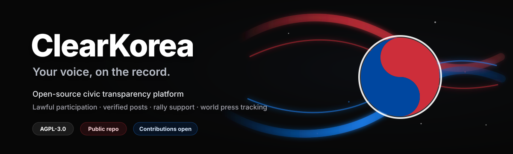

[English](README.md) | [한국어](README.ko.md)

# 클리어코리아란

> **투명한 선거와 재투표를 요구하는 시민들의 온라인 광장.**

클리어코리아는 6·3 지방선거 투표 부실 사태를 계기로 만들어진 시민 플랫폼입니다. 현장 집회에 나가기 어려운 사람들이 온라인에서 목소리를 내고, 집회를 지원하고, 인증으로 연대할 수 있는 공간입니다.

특정 진영의 사이트가 아닙니다. **진상규명, 재발방지, 선거 투명성, 재투표 요구**라는 폭넓게 공유되는 요구를 담는 공론장을 지향합니다.

## 핵심 기능

- **Home** — 참여 인원·목소리 수와 실시간 현황 한눈에
- **Rallies** — 집회 정보·지도 + 배달 응원 등 지원 가이드
- **Square** — 핵심. 목소리를 남기고 함께 외치는 온라인 시위장
- **Live** — 집회 현장 유튜브 생중계 모음
- **News** — 공인·준공인 인증 발언, 시민 인증, 외신 보도(+ 제보)

## 시작하기

- 랜딩 페이지의 **Enter** 버튼으로 입장합니다.
- **게스트**: 별도 가입 없이 바로 참여할 수 있습니다(목소리 작성, 댓글, 제보). 닉네임은 가입 시 자동으로 발급됩니다.
- **로그인**: 구글·카카오·네이버 계정으로 로그인하면 관리자 신청 등 추가 기능을 쓸 수 있습니다.
- 화면은 모바일 세로 기준의 단일 반응형 레이아웃이며, PC에서는 동일한 화면이 넓게 펼쳐집니다.

## 화면 구성 (하단 5개 탭)

### 1. Home (홈)
서비스의 실시간 현황을 한눈에 보는 대시보드입니다.
- 상단에 **참여한 사람 수**와 **목소리 수** 카운터가 고정 표시됩니다.
- 집회 지역의 실시간 혼잡도 지표를 보여주되, 집회 인원으로 단정하지 않습니다.
- 주요 목소리, 인증 게시물, 해외언론 보도 하이라이트를 카드로 모아 보여줍니다.

### 2. Rallies (집회)
오프라인 집회 정보와 지원 방법을 모은 페이지입니다.
- 진행 중·예정 집회를 장소, 시간, 현황과 함께 리스트로 제공하고 지도에 표시합니다.
- 배달 응원 보내는 법 등 **지원 가이드**를 안내해, 현장에 못 가는 사람도 후방에서 연대할 수 있습니다.

### 3. Square (광장) — 핵심
온라인 시위장입니다. 플랫폼의 중심 진입점입니다.
- **Speak up** 입력창으로 목소리를 남기고, 댓글과 공감으로 호응할 수 있습니다.
- 상단에 참여 인원·목소리 수 집계가 고정됩니다.
- 게스트도 자동 발급 닉네임으로 즉시 글을 쓸 수 있습니다.

### 4. Live (라이브)
집회 현장 생중계를 모아 보는 페이지입니다.
- 검증된 유튜브 스트림을 그리드로 보여줍니다.
- 종료된 방송은 다시보기로 보관됩니다.

### 5. News (소식)
인증된 발언과 시민 인증, 외신 보도를 모은 페이지로 4개의 탭으로 나뉩니다.
- **All**: 인증·일반이 섞인 전체 타임라인
- **Verified**: 공인·준공인(준공인은 연예인·유튜버·메가 인플루언서 등 포함)의 인증 게시물(인증 배지 + 본인 SNS 임베드 + 입장문)
- **Public**: 일반 시민의 응원·배달 인증 피드
- **World press**: 외신 보도 모음(썸네일과 제목, 클릭 시 원문으로 이동)
- 우측 상단 **Report a post** 버튼으로 게시물을 제보할 수 있습니다.

## 주요 기능

- **목소리 집계**: 참여한 사람 수와 목소리 수를 따로 집계해 상단에 노출합니다.
- **제보 (Report a post)**: 공인·준공인명과 SNS 링크만 입력하면 제보됩니다. 링크 유효성을 검증한 뒤 관리자 승인을 거쳐 Verified에 노출됩니다.
- **관리자 신청 (Apply as admin)**: 로그인한 유저가 이름·지역·연락처·자기소개·지원 이유를 제출하면, 최고 관리자가 승인합니다. 부적격자는 권한 해제가 가능합니다.
- **안전 장치**: 신고 버튼과 관리자 모더레이션을 기본 제공합니다.

## 운영 원칙

- 특정 개인의 신상정보 게시·추적을 금지합니다.
- 불법 행위(개표소 물리 봉쇄, 사적 제재 등)의 조장·모의를 금지합니다.
- 합법적 의사표현, 집회 정보 공유, 인증 연대만을 지원합니다.
- 클리어코리아는 공개 오픈소스 플랫폼으로 운영합니다. 누구나 GitHub issue와 pull request로 기여할 수 있습니다: https://github.com/KR20260603/clearkorea
- 시크릿, 어드민 이메일 화이트리스트, API key, DB password, 배포 토큰은 절대 커밋하지 않습니다.

## 라이선스

클리어코리아는 **AGPL-3.0-only** 라이선스로 배포합니다. 수정된 버전을 웹 서비스로 운영하는 경우에도 대응 소스 공개를 요구하므로, 투명성을 핵심 가치로 둔 플랫폼에 맞습니다.
